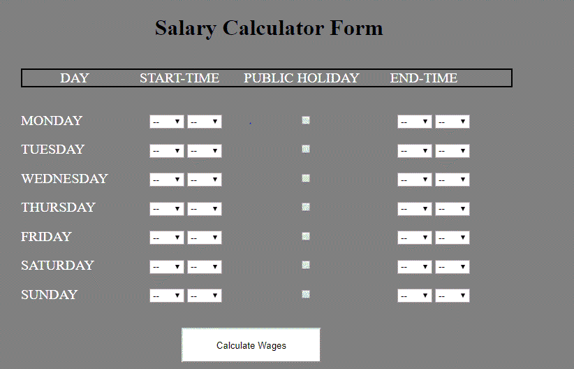

# Salary Calculator 
The purpose of this application is calculate the weekly wages of a person.

## Scenario
Bob enter the start time time and the end time work for the whole week via the form in the application.The application expect the user to enter time in 24 hours clock.Suppose Bob is rostered on Monday from 0000  to Monday morning 0600.Then in the application we select Monday's start-time to be 00 hours 0 min and select on Monday's end-time to 06 hours and 0 min.Select the check box for Public Holiday if the day you happen to work is a public holiday.(ie the start-time is on public holiday.)Please note that this application does not calculate the wages where the start time and the end time do not fall on the same day.In future work i can possible incorporate calculation where a shift start time and end time fall on two different days.

## Business Rules for calculating the salary.
Salary is calculated in 15-min block.For example.A person can get paid 5 hours 15 miniutes or 30 minutes or 45 minutes.

Salary Calculation are as follows: 
- Hourly rate : Example  $21.50 per/hour
- 00 hours to 0500 hours Mon-Fri : 130% of base hourly rate.
- 0500 hours to 2400 hours Mon-Fri : 100% of base hourly rate.
- Public Holiday 250% of base hourly rate.
  >If your shift start on a public holiday but end on a normal day you will be paid public holiday rates for the whole shift.If your shift start on a normal day but end on a public holiday you will be paid normal rates for the whole shift.     
- 00 hours to 0600 Sat: 130% of base hourly rate.
- 0600 hours to 2100 Sat: 100% of base hourly rate.
- 2100 hours to 2400 Sat: 125% of base hourly rate. 
- Sunday 2100 to 2400 : 200%  base hourly rate.
- Sunday 06 to 2100 : 150%  base hourly rate.
- Sunday 00 to 0600 : 200%  base hourly rate.

## Supporting documents.
Formula to calculate the tax can be found in the document named "Calculating-amounts-to-be-withheld-2018-19.pdf".

## Future work.
Calculate wages when start time and end time are on diffrent days.
Payroll system with database where the pay rules are different for for each employee.

